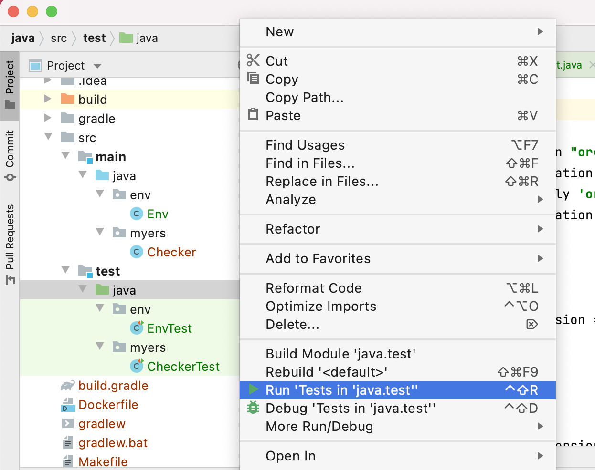

# Myers Triangle for Java
## プロジェクト環境構築
このリポジトリのイメージとスクリプトを使い IntelliJ で開発する例です

tool   | version | env                               
:--    | :--     | :--                                 
Java   | 11      | ローカルになければインストールされる
Gradle | 7.2     | リポジトリに同梱されている          
JUnit  | 5.7     | ローカルの Gradle で実行する        
JShell | 11      | Docker コンテナ内で起動する         

### Java と依存ライブラリのインストール
```
$ make init
```

## テスト実行
IntelliJ から実行する



もしくはコマンドラインで実行する

```
$ make test

BUILD SUCCESSFUL in 2s
3 actionable tasks: 1 executed, 2 up-to-date
```

## 開発補助
### Java 対話シェル
ローカルの java が 8 以下の場合かつ JShell を使いたい場合のみ、Docker コンテナ内の Java 11 で JShell を起動する

イメージの作成

```
$ make build
```

JShell の起動

```
$ make java
```

Java の実行が可能なので、メソッドの動作確認に用いると便利

```
jshell> Arrays.asList(1, 2, 3).size() + 5
$1 ==> 8
```

### メイン文実行
```
$ make main args='3 3 3'
```

### コンテナ接続
必要であれば
正三角形

```
$ make bash
```

