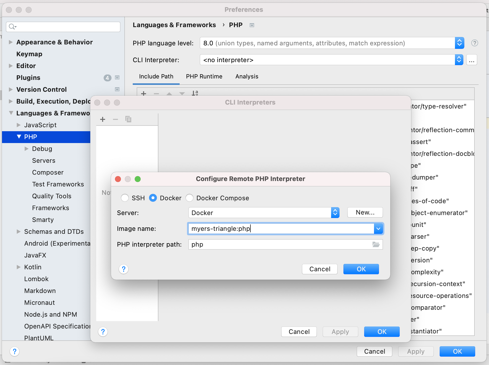
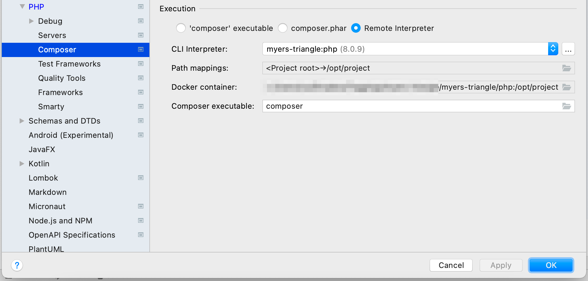
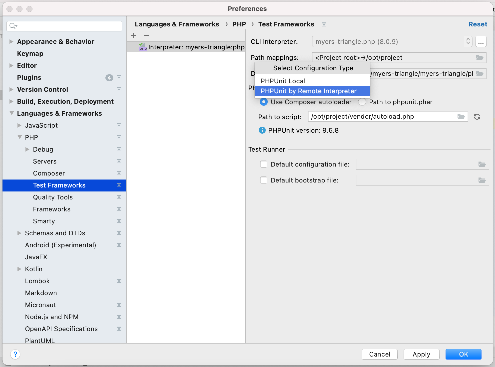
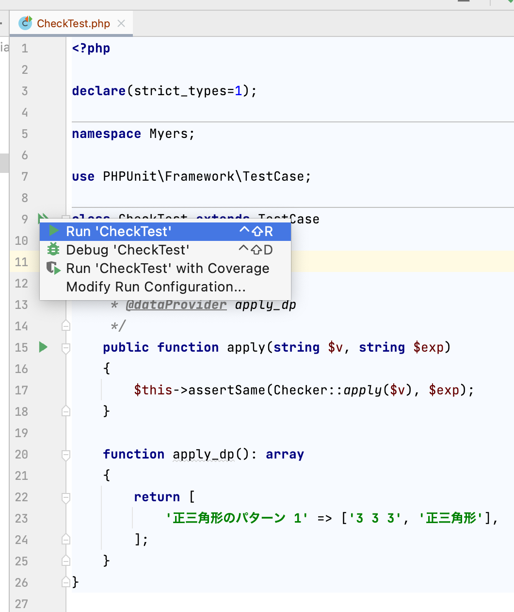

# Myers Triangle for PHP
## プロジェクト環境構築
ここではこのリポジトリのイメージとスクリプトを使い IntelliJ で開発する例を示す

tool     | version | env                               
:--      | :--     | :--                               
PHP      | 8.0     | Docker コンテナ内で実行する       
Composer | 2.1     | 同上                              
PHPUnit  | 7.3.0   | 同上                              
PsySH    | 8.0     | 同上                              

### Docker イメージの作成
```
$ make build
```

### 依存ライブラリのインストール
```
$ make init
```

### エディタ設定
PHP Docker プラグインをインストールする

`Preferences` → `PHP` の `CLI Interpreter` を `myers-triangle:php` にする



`Preferences` → `PHP` → `Composer` の `CLI Interpreter` を同じく `myers-triangle:php` にする



`Preferences` → `PHP` → `Test Frameworks` の `Interpreter:` を同じく `myers-triangle:php` にする  
`PHPUnit library` は `Use Compsoer autoloader` を選択し、`/opt/project/vendor/autoload.php` を指定する



## テスト実行
IntelliJ から実行する



もしくはコマンドラインで実行する

```
$ make test

.                                                                   1 / 1 (100%)

Time: 00:00.137, Memory: 4.00 MB

OK (1 test, 1 assertion)
```

## 開発補助
### PHP 対話シェル
psysh の起動

```
$ make php
```

PHP の実行が可能なので、メソッドの動作確認に用いると便利

```
>>> count([1, 2, 3]) + 5
=> 8
```

自作のメソッドを呼ぶ場合は次の通り

```
>>> \Myers\Checker::apply('3 3 3')
=> "正三角形"
```

### Docker コンテナに接続
必要であれば

```
$ make bash
```
